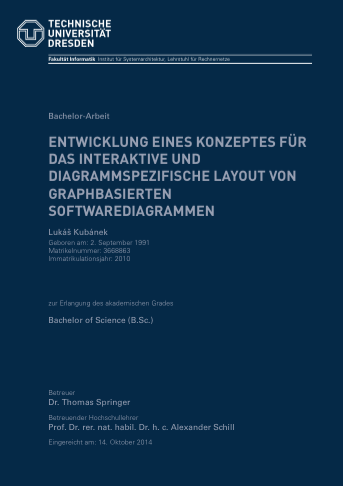

# Bachelor Thesis

This repository contains the Latex sources for my bachelor thesis titled *"A concept for an interactive and diagram-specific layout of graph-based software diagrams"* which was written in German language at [Dresden University of Technology](http://tu-dresden.de) in 2014.

You can find the complete thesis [here](https://dl.dropboxusercontent.com/u/10454292/bachelor-thesis.pdf).

